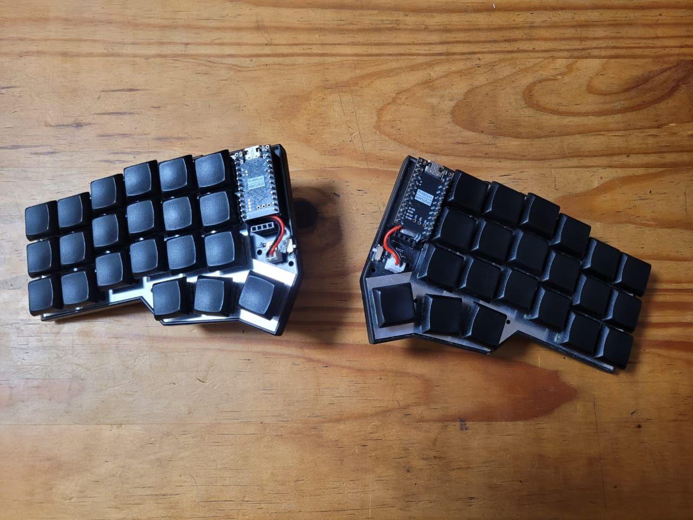
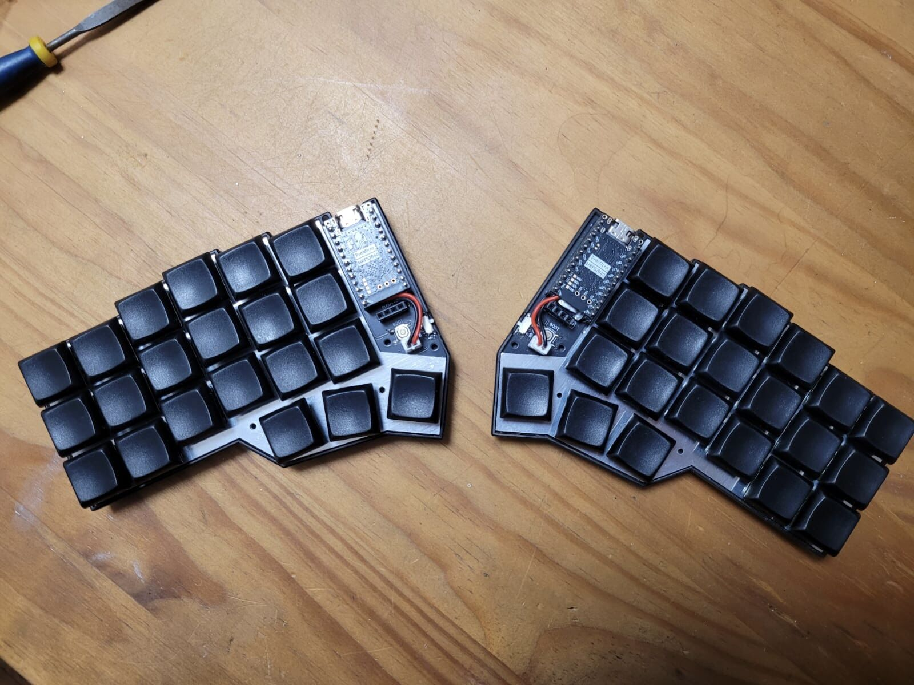
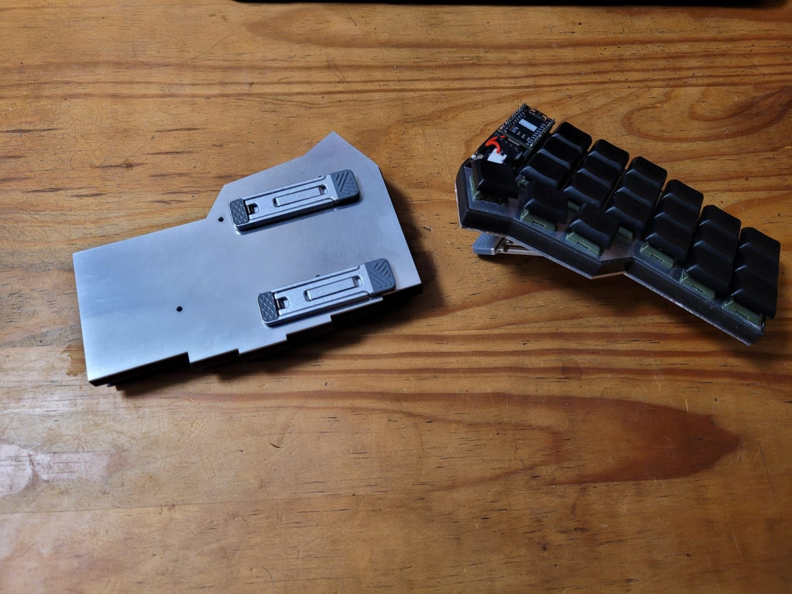
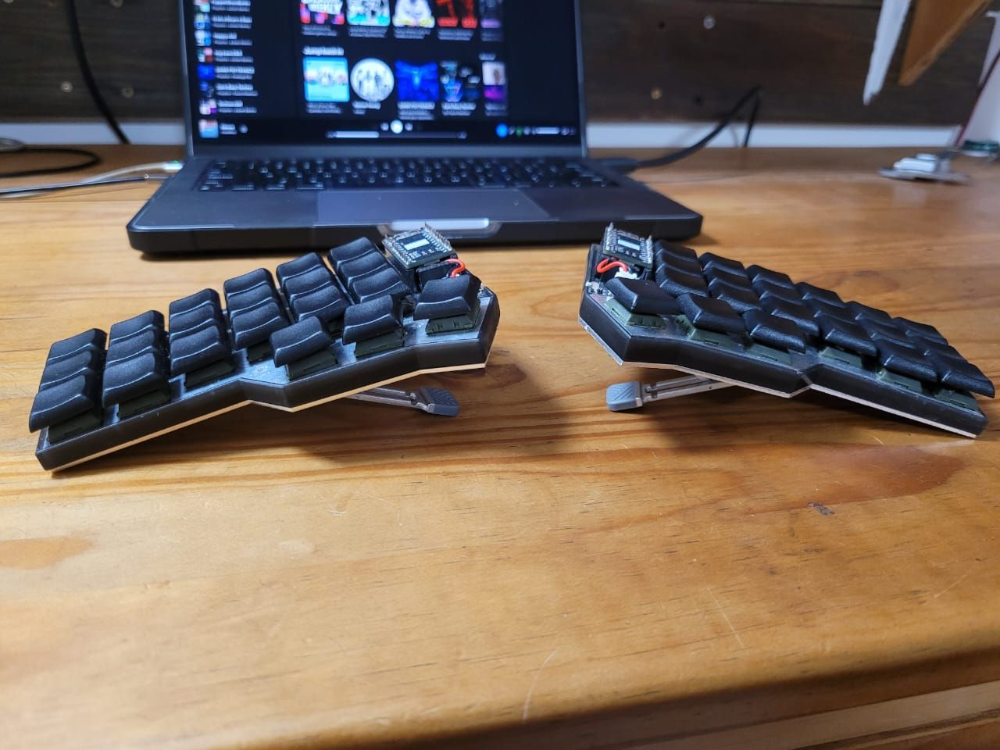
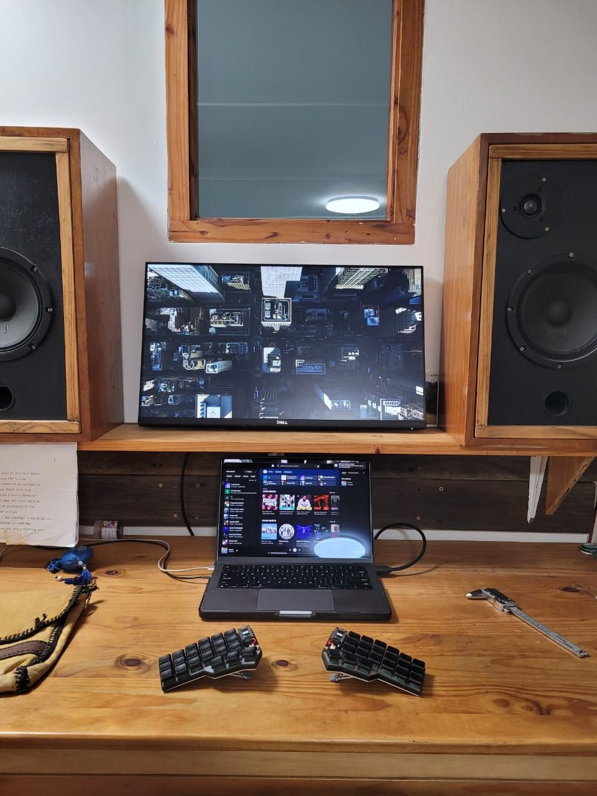

# Corne Choc — Wireless Build

A wireless, hot-swappable Corne (crkbd) split keyboard built around Kailh Choc V2 switches and the Corne Chocoflan PCB.

## Final Build Spec

| Decision | Choice |
| --- | --- |
| **Layout** | Corne (3×6 + 3 thumb, split) |
| **PCB** | [Corne Chocoflan](https://github.com/ergomechstore/Corne-chocoflan) (wireless, choc-spaced) |
| **Switches** | Kailh Choc V2 Low Profile — White Rain, Black Cloud, Ghost  |
| **Microcontroller** | SuperMini nRF52840 (cheap Nice!Nano-compatible alternative) |
| **Wireless** | Yes (ZMK / nRF52840) |
| **OLED** | Yes — SSD1306 |
| **Hot-swap** | Yes — Kailh Choc sockets |
| **LEDs** | No (skipped to preserve battery on wireless) |
| **Keycaps** | Choc V2 blanks (surprisingly nice quality) |
| **Case** | [Wireless Corne Chocoflan minimal case](https://www.printables.com/model/1020389-wireless-corne-chocoflan-minimal-keyboard-case/files) |

## Guides & References

- **Official Corne Choc docs** — [foostan/crkbd](https://github.com/foostan/crkbd/tree/main/docs/corne-chocolate)
- **Build log inspiration** (V1 caps, no hot-swap) — [Choc Spaced Corne Wireless](https://github.com/rafaeldelboni/buildlogs/blob/main/crkbd-choc-spaced-switch.md)
- **Chocoflan build blog** — [sascha.sh: I built another mechanical keyboard](https://sascha.sh/posts/i-built-another-mechanical-keyboard/)

### Microcontroller notes
- **SuperMini nRF52840** *(chosen)* — cheap (~$3–5 each), well documented for a Chinese alternative. [Reddit overview](https://www.reddit.com/r/ErgoMechKeyboards/comments/16q5b2c/supermini_nrf52840_a_6_nicenano_20_compatible_mcu/) · [Alternatives wiki](https://github.com/joric/nrfmicro/wiki/Alternatives)
- **Nice!Nano** — the standard, well-documented option, but pricey (~$24 each + shipping).

### Switch references
- [Kailh Choc Switch Impressions](https://www.youtube.com/watch?v=mxUqfPf_1B0)
- [Kailh Choc V2 Red Low-Profile Sound Test](https://www.youtube.com/watch?v=VXPfzeLmQ5g)

### Keycap references (alternatives considered)
- [3D-print: Choc Louder keycaps (choc + MX spacing)](https://www.printables.com/model/1066117-choc-louder-keycaps-choc-and-mx-spacing/files)
- [Resin-printed low-profile caps](https://www.thingiverse.com/thing:4862025)

### Case references (alternatives considered)
- [Slim wireless Corne case](https://www.printables.com/model/416378-wireless-corne-case)
- [Carry case with travel box](https://www.printables.com/model/544127-wireless-corne-choc-v2-case-with-travel-box/files)
- [Case with OLED cover (5×3 Typeractive)](https://www.printables.com/model/441819-wireless-corne-case-5x3-typeractive)

## Bill of Materials

### Electrical Parts

| Part | Specific Part | Link | QTY | Notes |
| --- | --- | --- | --- | --- |
| Microcontroller | SuperMini nRF52840 | | 2 | Cheap alternative to the Nice!Nano |
| MCU headers | | [AliExpress](https://www.aliexpress.com/item/32896689725.html) | 10 × 40-pin (400 pins) | |
| PCB | Corne Chocoflan | [repo](https://github.com/ergomechstore/Corne-chocoflan) | 5 pairs | |
| Switches | Kailh Choc V2 Low Profile — White Rain | [AliExpress](https://www.aliexpress.com/item/1005009022408681.html) | 90 | |
| Switches | Kailh Choc V2 Low Profile — Black Cloud | [AliExpress](https://www.aliexpress.com/item/1005009022408681.html) | 90 | |
| Switches | Kailh Choc V2 Low Profile — Ghost | [AliExpress](https://www.aliexpress.com/item/1005007404357477.html) | 90 | |
| Hot-swap sockets | Kailh Choc sockets | [AliExpress](https://www.aliexpress.com/item/1005008954571807.html) | 220 | |
| Keycaps | Choc V2 blanks | [AliExpress](https://www.aliexpress.com/item/1005009100305250.html) | 220 | Nicer quality than expected |
| Diodes | 1N4148W SMD | [AliExpress](https://www.aliexpress.com/item/32921490945.html) | | |
| OLED display | SSD1306 | [AliExpress](https://www.aliexpress.com/item/1005008640132638.html) | 10 | |
| On/off switch | | [AliExpress](https://www.aliexpress.com/item/1005003829889015.html) | 20 | |
| Reset buttons | Momentary push buttons | [AliExpress](https://www.aliexpress.com/item/1005002201965659.html) | 100 | |
| Battery | LiPo 3.7V 120mAh (PH2.0 connector) | [DIY Electronics](https://www.diyelectronics.co.za/store/li-ion-li-po/6707-lipo-battery-37v-120mah-25x24x35mm-1c-1cell-with-ph20-connector.html) | 2 | |

### Mechanical Parts

Driven by the Chocoflan PCB and the minimal case choice.

| Part | Specific Part | Link | QTY | Notes |
| --- | --- | --- | --- | --- |
| Case | Wireless Corne Chocoflan minimal case | [Printables](https://www.printables.com/model/1020389-wireless-corne-chocoflan-minimal-keyboard-case/files) | 1 set | 3D printed |
| Bottom Plate  | See `plate_cut*.dxf` / `.svg` in repo  | | | lazer cut from Aluminimum |
| Switch plate | See `plate_cut*.dxf` / `.svg` in repo  | | | lazer cut from Aluminimum |
| Standoffs + screws | | | | |
| PK-662 tenting stands | | | | |

## Firmware Setup & Configuration

This board runs [ZMK](https://zmk.dev). Firmware is built in the cloud by GitHub Actions — no local toolchain needed. Full guide: [zmk.dev/docs/user-setup](https://zmk.dev/docs/user-setup).

**Setup (once):**
1. Run the ZMK setup script (or `zmk init`) to create your config repo.
2. Choose the keyboard and controller when prompted:
   - **Keyboard / shield:** `Corne`
   - **Board:** `nice_nano_v2` (the SuperMini nRF52840 is nice!nano-compatible)
3. Push the repo to GitHub.

**Configure:**
- Keymap lives in `config/corne.keymap` — edit layers, combos, behaviors here.
- Feature flags live in `config/corne.conf` — e.g. enable the OLED and disable RGB:
  ```ini
  CONFIG_ZMK_DISPLAY=y
  # no underglow / per-key LEDs on this build
  ```

**Build & flash:**
1. `git push` → GitHub Actions builds automatically.
2. Download the `firmware` artifact from the Actions tab — it contains the `.uf2` files (one per half, plus a `settings_reset`).
3. Double-tap reset on a half to enter bootloader, then drag the matching `.uf2` onto the USB drive that appears. Repeat for the other half.

## Credits

- **PCB** — [Corne Chocoflan by ergomechstore](https://github.com/ergomechstore/Corne-chocoflan). The Gerbers and KiCad source in `PCB/` are vendored from this open-source project.
- **Layout** — [Corne (crkbd) by foostan](https://github.com/foostan/crkbd).
- **Case** — [Wireless Corne Chocoflan minimal case](https://www.printables.com/model/1020389-wireless-corne-chocoflan-minimal-keyboard-case/files).

## Repo Contents

- `PCB/` — pointer to the external Corne Chocoflan PCB design (no source vendored).
- `Laser Cutting/` — switch/plate cut files (`.dxf`, `.svg`, `.pdf`).
- `3D Prints/` — case and cover models (`.step`, `.stl`, `.f3d`), including a custom MK2 chassis and carry case explored during design.
- `images/` — build photos.
- `brainstorming.md` — original decision notes and research (kept for history).

## Build Photos






